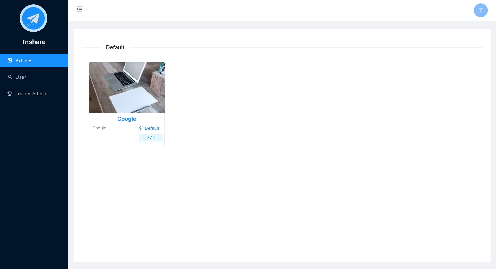
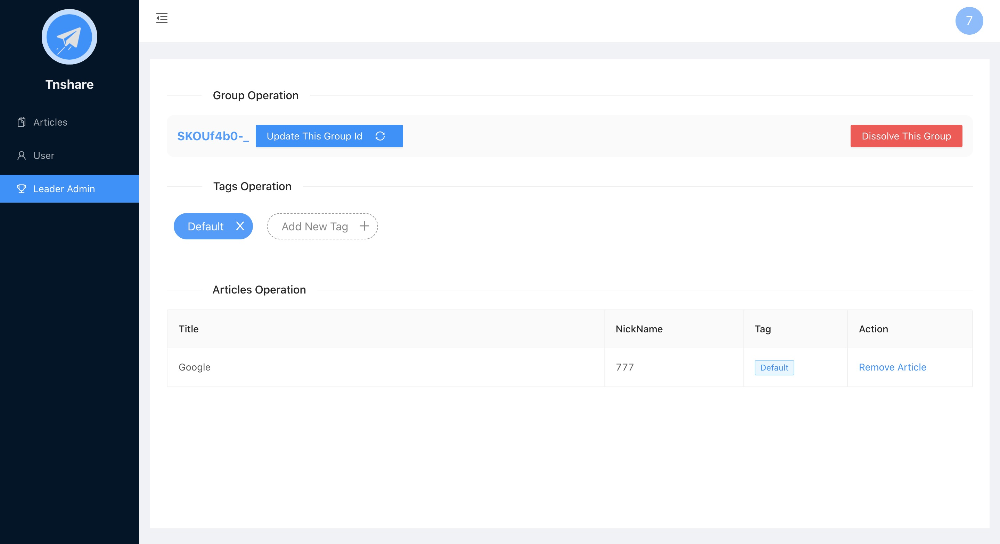
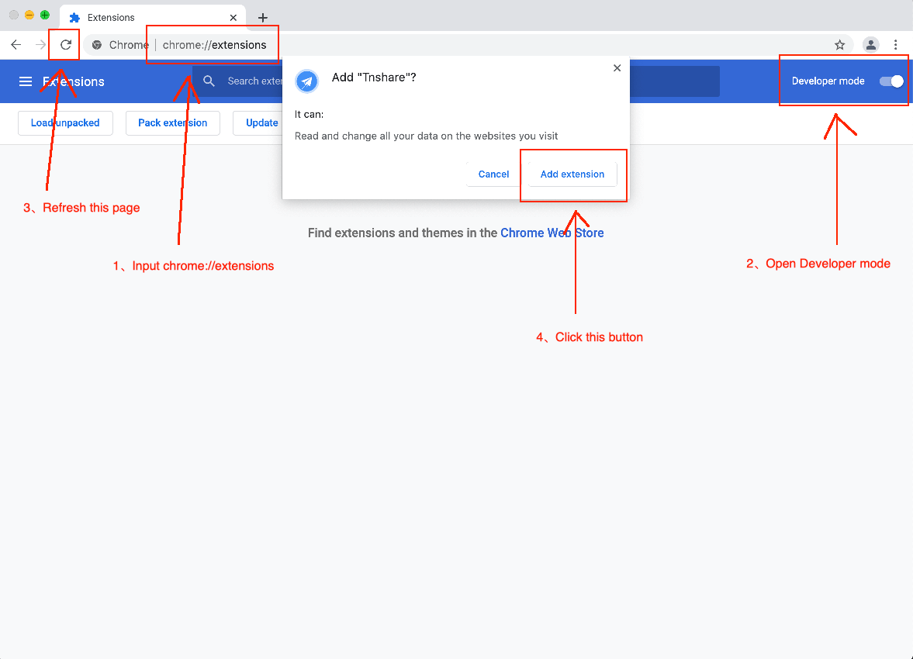

 
 <h2 align="center">Tnshare Tutorial</h2>
 
A Chrome Bookmarklet Sharing System

  <a href="https://github.com/betterTisen/Tnshare_Doc/releases">Download</a>
  |
  <a href="#user-content-features">Features</a>
  |
  <a href="#user-content-install-the-tutorial">Install</a>

  <a href="/README.md">Englisn </a>
  |
  <a href="/docs/readme_cn.md">简体中文</a>

As the complexity of web sites increases, various types of efficient web sites are used as productivity tools with different functions. More and more websites are needed by the team. This extension realizes the unified management of multi-user public bookmarks and improves the team's collaborative efficiency. It is a knowledge sharing platform that can be added by one user and Shared by multiple users

# Features

- Enter `Articles` to see the bookmark information of the added webpage, click the corresponding bookmark to skip to the corresponding webpage.

- If you are a Group member, you can exit your Group in `User`.
- Group creators can remove other added User members from `User`

- Group enrollees cannot see the `Leader Admin`page, which is only a function used by Group creators
- Group creators can update their `Group ID`, add/remove Group Tags, delete articles, and disband the current Group

# Install

1. Download [tnshare.crx](https://github.com/betterTisen/Tnshare_Doc/releases) package
2. Copy and paste `chrome://extensions/` into the address，Press Enter to the extension page
3. Install extension：Developer mode -> Refresh -> Drag the downloaded `tnshare-crx` file into the extension

# End

As this project is in the operational stage, there is no plan to open source for the time being, and the front-end part may be open source in the future. Thank you for your support and understanding